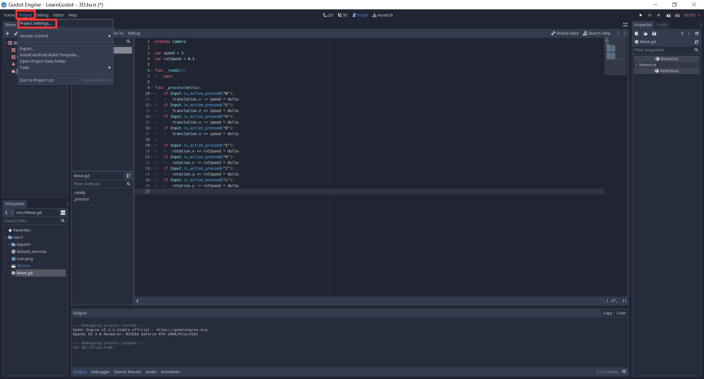
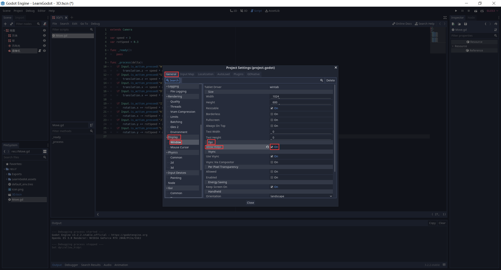

# LearnGodot

## Editor

**Godot's 3D editor**

1. Mousewheel up/down: Zoom in/out.
2. Middle button + drag: Orbit the camera around the current target.
3. Shift + middle button + drag: Pan camera up/down/left/right.
4. Right-click + drag: Rotate camera in place.

```
https://www.oreilly.com/library/view/godot-engine-game/9781788831505/7fb4274c-5ae3-4833-b394-6d5115cac0a8.xhtml
```

## Useful Nodes

- MeshInstance
- Light
  - Directional Light：记得要在控制面板开启Shadow，推荐Rotation：(-45, 45, 0)
- Camera：点击Inspector走上角Preview进行预览

## 快捷键

- Ctrl + D：增殖节点（复制）
- F：选中选中项
- 鼠标滚轮：放大缩小
- 鼠标中键拖动：围绕选中项旋转
- Shift + 鼠标中键拖动：平移
- Ctrl + Alt + M：Move（使物体平移到Editor Camera处）
- Ctrl + Alt + F：Focus（使物体旋转与Editor Camera一致）

## 关于中文

- 中文可以作为节点名
- 中文不能作为文件名，否则导出安卓平台会出错
- 中文不能作为代码变量名

## 材质

- Albedo：反照率（颜色）
- Metallic：金属度
  - Metallic：金属度子选项
  - Specular：高光
- Roughness：粗糙度
- Refraction：折射
  - Enabled：是否启用
  - Scale：折射率（-1 ~ +1）
  - 注意：开启折射的物体，影子会消失，并且不会被其他物体折射（无法多物体折射）

示例：

白色半透明玻璃球：

- Albedo：0,180,255,88
- Metallic
  - Metallic：1
  - Specular：1
- Roughness：0.2
- Refraction
  - Enabled：On
  - Scale：0.05

金属球：

- Albedo：222,186,46,255
- Metallic
  - Metallic：0.5
  - Specular：0.75
- Roughness：0.2
- Refraction
  - Enabled：Off

光滑反光地板：

- Albedo：255,255,255,255
- Metallic
  - Metallic：1
  - Specular：1
- Roughness：0
- Refraction
  - Enabled：Off

## GDScript

开头一定要继承基类：

```
extends Camera
```

定义变量：

```
var speed = 3
var rotSpeed = 0.3
```

游戏循环：

```
func _ready():
	pass

func _process(delta):
	pass
```

接收输入：

```
if Input.is_action_pressed("W"):
	translation.z -= speed * delta
if Input.is_action_pressed("S"):
	translation.z += speed * delta
if Input.is_action_pressed("A"):
	translation.x -= speed * delta
if Input.is_action_pressed("D"):
	translation.x += speed * delta

if Input.is_action_pressed("I"):
	rotation.x += rotSpeed * delta
if Input.is_action_pressed("K"):
	rotation.x -= rotSpeed * delta
if Input.is_action_pressed("J"):
	rotation.y += rotSpeed * delta
if Input.is_action_pressed("L"):
	rotation.y -= rotSpeed * delta
```

## 高DPI支持





## 导出到安卓平台

直接导出会报错：


2. 打开Editor - Editor Settings，在左边栏向下滚动，找到Export下面的Android选项，
    会发现`ADB、Jarsigner、Debug Keystore`没有填上，接下来我们要一一填上。

2. 在`ADB`填上`你的解压路径\ADB\adb.exe`

3. 在`Jarsigner`填上`你的解压路径\JDK\bin\jarsigner.exe`

4. `Debug Keystore`需要自己生成，生成方式如下：

    - Win+R打开运行提示框，输入cmd回车

    - 在弹出来的cmd窗口中输入命令：`cd /d 你的解压路径\JDK\bin`

    - 运行命令：

        ```
        keytool -keyalg RSA -genkeypair -alias androiddebugkey -keypass android -keystore debug.keystore -storepass android -dname "CN=Android Debug,O=Android,C=US" -validity 9999 -deststoretype pkcs12
        ```

5. 点击“项目-导出...”，在“预设”旁边点“添加...”，然后点Android，就添加了一个安卓导出预设。

6. 点“导出项目”，选择你要导出的路径，然后点“保存”，即可。

7. 注意！一定要勾上左下角的“使用调试导出”，否则导出失败！
